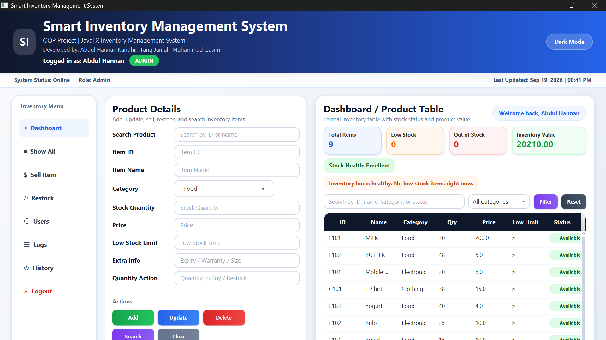
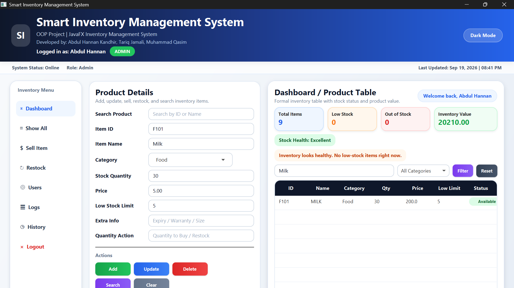
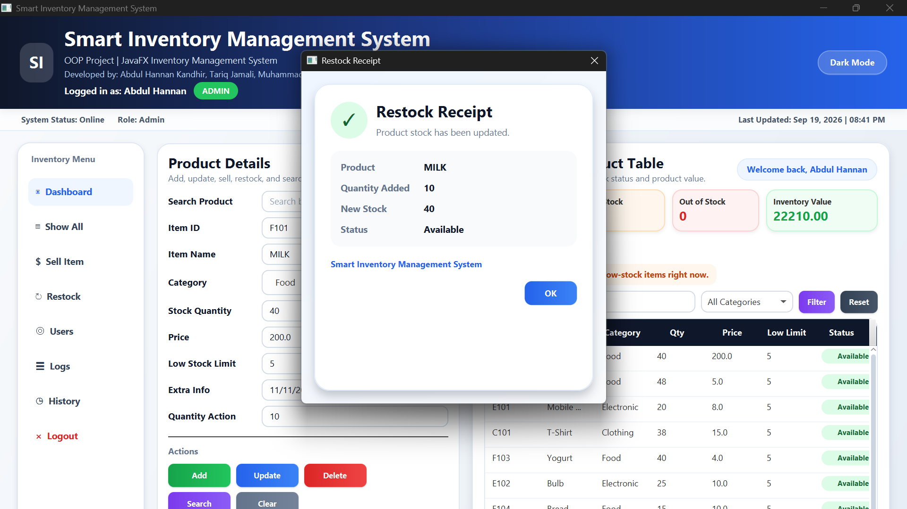
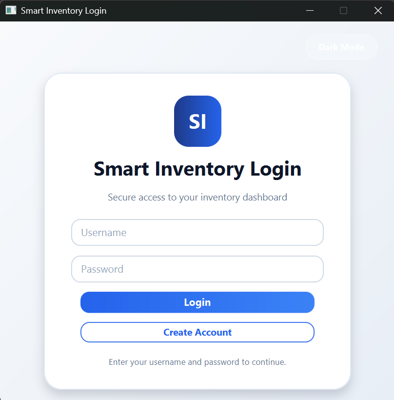

# Java Inventory Management System

A desktop inventory management application built using Java, JavaFX, and Object-Oriented Programming.

## Features

- User login system
- Inventory management
- Add and manage inventory items
- Search inventory records
- Track item quantity and price
- Low-stock tracking
- Different item categories
- Activity logging
- JavaFX graphical user interface

## Technologies Used

- Java
- JavaFX
- Object-Oriented Programming
- CSS

## OOP Concepts Used

- Classes and Objects
- Encapsulation
- Inheritance
- Polymorphism
- Exception Handling
- Collections

## Project Structure

The project contains classes for:

- Inventory management
- User management
- Login system
- Food items
- Electronic items
- Clothing items
- Session management
- Activity logging

## What I Learned

This project helped me improve my Java programming skills and understand how Object-Oriented Programming can be used to build a complete application.

I also practiced creating graphical user interfaces with JavaFX, managing multiple classes, handling user input, and organizing a larger Java project.

## Screenshots

### Main Dashboard

### Search Feature

### Stock Management

### Login Screen

## Author

Abdul Hannan Kandhir

Computer Science Student
